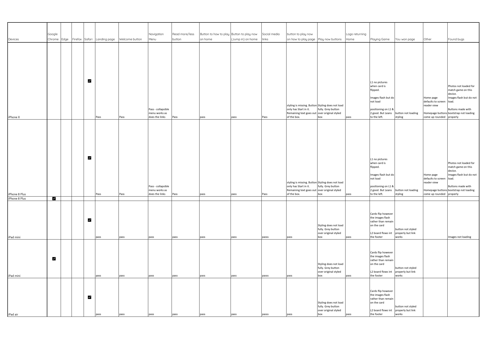
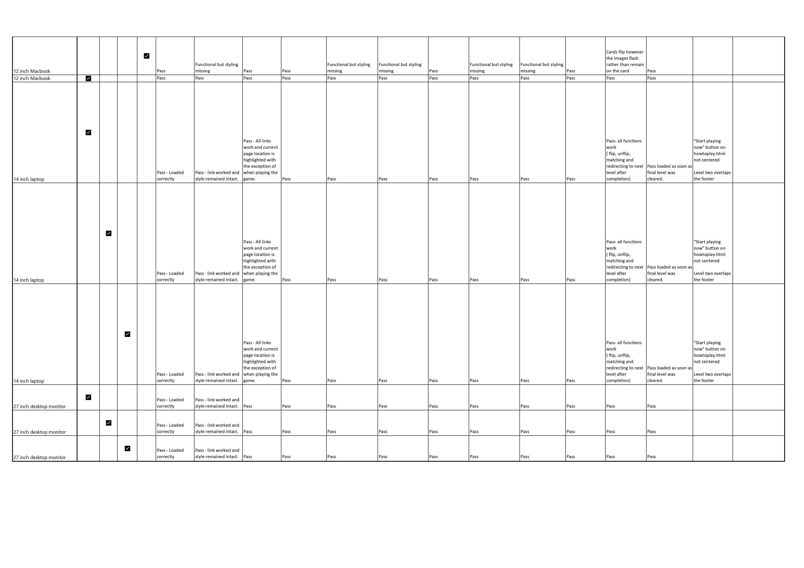

# Mari Mems gets tested 
## User stories 
- As an existing player of memory games, I want to be challenged by a new game, have fun and improve my memory.
    - The game has three levels that are played consecutively to win with celebratory message at the end where players and play again witha new shuffle
- As a potential player of memory games, I am interested in fun ways to improve my memory.
    - The game is easy to understand, brightly coloured and fun
- As an existing player of memory games, I am interested in new memory game concepts
    - The game focuses on peoples faces as theme and places emphasis on brain training.
- As a potential player of memory games, I look for something I can and would want to play over and over. 
    - The game allows users to restart the game with a new shuffle 

## Manual testing 

Please find the full testing document [here](https://1drv.ms/x/s!AiwsYx99ZOMqgs8JYOrI9QXp8Md7sA?e=jFq7fg)

## Bugs
- On my apple devices
    - Photos not loaded for game instead they flash on the screen. occured across iPhones, Macs using safari, and ipads.
    - The photos did load on the macbook when using Google chrome. 
    - Buttons made with bootstrap not loading properly on apple devices with the exception of Macbook using chrome.
        - Status: Unresolved

- Double clicking a single picture caused the game to crash
    - Solution: Added a lockboard and board reset in JavaScript
     to stop multiple cards being turned over and to reset clicks after two cards were turned over

- The footer moved away from the bottom of the screen
    - removed the navigation bar from the header tag