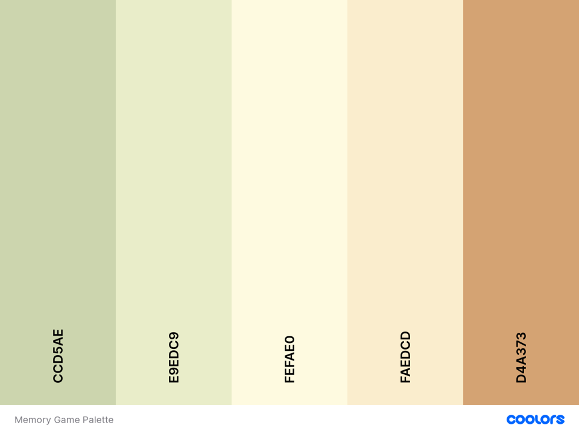

# Mari Mems
Mari Mems is the company behind Face match, a multi-level memory game where players must match the cards of strangers faces to win. 
The website features a card matching game, how to play, who are Mari Mems and information on brain training. 
Mari Mems is a fictional memory game company created for the purpose of this project.

[Please see the deployed site here](https://marijoke.github.io/MSP2-MemoryGame/)
## UX
This website is for:
- People who currently enjoy any form of brain training.
- People who want to improve their memory.
- People who struggle with faces and want to improve their ability to remember faces
- People interested games to improve recall.
- People with a specific interest in card matching games.

The website is easy to manoeuvre using buttons and the drop-down menu. 

I created the back of my cards to tie in with the theme and the brand created. This presents a clean uniformed look to the player. 

### Wireframes
I created wireframes using [Balsamiq](https://balsamiq.com/)

[Please see Wireframes here.](https://photos.app.goo.gl/b5QyRGzz2RgkKBySA)

### Fonts 
The fonts chosen for the website are:
- [Fredoka One](https://fonts.google.com/specimen/Fredoka+One?preview.text_type=custom). I chose this font to be the font of the company Mari Mems. The font also doubles as the logo. It is big, bold and fun which is what the brand portrays themselves to be.
- [Quicksand](https://fonts.google.com/specimen/Quicksand?preview.text_type=custom). I chose this font for my headings as it was clean, friendly font that was bold enough to be the heading without being too distracting near the logo, nor is it unpleasant to the eyes across various sizes.
- [Open Sans](https://fonts.google.com/specimen/Open+Sans?preview.text_type=custom). Open sans was recommended as a complimentary font Quicksand for the body. I liked how they looked together and appreciated the simplicity of the font especially in comparison to the logo and bold colours.

### Colours
I used [Coolers](https://coolors.co/) to look up suitable colour schemes. I wanted colours that complimented each other but were also bold, warm and inviting.

## User Stories 
- As an existing player of memory games, I want to be challenged by a new game, have fun and improve my memory.
- As a potential player of memory games, I am interested in fun ways to improve my memory.
- As an existing player of memory games, I am interested in new memory game concepts
- As a potential player of memory games, I look for something I can and would want to play over and over. 

## Features
### Existing Features
- Collapsible Navigation menu – allows players to move between pages with ease regardless of the size of their device.
- Footer – features social media links to the Mari Mems social pages for direct contact with the company. Mari Mems uses their socials to provide players with updates and the newest memory games. 
- Mobile First design – allows users to view the website across multiple platforms without compromising usability.
- Alternative text - All images including feature alternative text to ensure website is accessible for those with visual impairments.
- Memory game - Created using JavaScript to create a board with cards that flip over and stay up when matched
- Timer - To show players how long it took them to solve the puzzle. They are then able to challenge themselves by trying to beat their last time.
- Read more/less button - This allows players to get more information on what they are interested in rather than filling the screen with large amounts of text. 
### Features Left to Implement
- Additional levels - The game currently has two levels but is set up to have at least 3. 
- Additional memory games - I have created a memory brand so would like to add other types of memory games.
## Technologies Used
- HTML5 
- CSS3
- [Bootstrap 4.5.3](https://getbootstrap.com/)
    - Used to simplify layouts and create consistency of design while enabling responsiveness. 
- [Balsamiq](https://balsamiq.com/)
    - Created Wireframes for the project prior to development
- [Github](https://github.com/) & [Gitpod](https://www.gitpod.io/)
    - Used to write, store and view code
- [Google fonts](https://fonts.google.com/)
    - Used to select fonts for the project
- [Font awesome V5.15.2](https://fontawesome.com/icons?d=gallery)
    -Used for the social media icons and the brain icon on the home page. 
- [Coverr](https://coverr.co/)
    - Used for pictures of the people in shown in the game. 
- [Pexels](https://www.pexels.com/)
    - Used for pictures of the people in shown in the game.   

## Testing
My Code has been checked using:
- [Markup Validation Service](https://validator.w3.org/#validate_by_input)
- [CSS Validation Service](https://jigsaw.w3.org/css-validator/)
- Google developer tool, Lighthouse. The report for this can be found [here](insert uploaded photo here)

My project has responded well to testing in various browsers on across multiple devices. 
- The project was tested in:
    - [Google Chrome](https://www.google.com/intl/en_uk/chrome/)
    - [Firefox](https://www.mozilla.org/en-GB/firefox/)
    - [Safari](https://www.apple.com/uk/safari/)
    - [Duck Duck go](https://duckduckgo.com/)

For more testing across multiple devices please see the [Mari Mems Tests](/workspace/MSP2-MemoryGame/MariMemsTests.md)

## Deployment

My project was deployed using GitHub Pages
-	While logged in to GitHub I located my project repository 
-	Selected settings
-	Scrolled to find GitHub Pages I selected Master as the source. 
-	Pressed save
-	After refreshing I revisited GitHub Pages in the settings and was able to click the link to see the site live. 

Local Deployment, run using Gitpod
-	Add the Gitpod browser extension on Google chrome
-	Login to your GitHub account
-	Locate the project repository and select the green Gitpod button which will open a workspace. 

### Bugs
- Double clicking caused the game to crash. This was resolved by adding lockboard in JavaScript. 
- The footer moves away from the bottom of the screen

## Credits
### Content 
- I used [Free code camp - Memory Game in Vanilla JavaScript](https://medium.com/free-code-camp/vanilla-javascript-tutorial-build-a-memory-game-in-30-minutes-e542c4447eae#id_token=eyJhbGciOiJSUzI1NiIsImtpZCI6ImU4NzMyZGIwNjI4NzUxNTU1NjIxM2I4MGFjYmNmZDA4Y2ZiMzAyYTkiLCJ0eXAiOiJKV1QifQ.eyJpc3MiOiJodHRwczovL2FjY291bnRzLmdvb2dsZS5jb20iLCJuYmYiOjE2MTUxMzI5NTQsImF1ZCI6IjIxNjI5NjAzNTgzNC1rMWs2cWUwNjBzMnRwMmEyamFtNGxqZGNtczAwc3R0Zy5hcHBzLmdvb2dsZXVzZXJjb250ZW50LmNvbSIsInN1YiI6IjEwMjA5NzgzODA0MDk3MzIwMzExMyIsImVtYWlsIjoibWFyaWFtYWphZGFtdUBnbWFpbC5jb20iLCJlbWFpbF92ZXJpZmllZCI6dHJ1ZSwiYXpwIjoiMjE2Mjk2MDM1ODM0LWsxazZxZTA2MHMydHAyYTJqYW00bGpkY21zMDBzdHRnLmFwcHMuZ29vZ2xldXNlcmNvbnRlbnQuY29tIiwibmFtZSI6Ik1hcmlhbSBBIiwicGljdHVyZSI6Imh0dHBzOi8vbGg0Lmdvb2dsZXVzZXJjb250ZW50LmNvbS8tdkMwV2l5OWZBeVkvQUFBQUFBQUFBQUkvQUFBQUFBQUFBQUEvQU1adXVjbjhpMW0zRWZ5MWxaY0JPU2J3MmUtdFVCZ2VWQS9zOTYtYy9waG90by5qcGciLCJnaXZlbl9uYW1lIjoiTWFyaWFtIiwiZmFtaWx5X25hbWUiOiJBIiwiaWF0IjoxNjE1MTMzMjU0LCJleHAiOjE2MTUxMzY4NTQsImp0aSI6IjUxN2NhM2NlMGU2MWVlMGI1ZmFjZDQ5N2FhZjhkNjNhNDIzYzk1NWMifQ.h9FNNd2hDpEaOhkIA6BOsriT5HJk0vQ4O6oOj6SGXaI9lIJ_iiVOaYGB_x_cyB1bwy5S7PBlzwShAmBa5O0egUFQRiMsoo8xQr4oMZl9MdrWEZf-YK6VL_lstrUIU7MtjvSZf53XcfyoAsq6INFm5oFvPi-LBh6b_GH-3fIHnQAd76c-LtnzE8PTUKZrc6nF0c_SCKTPdeYIFt7FqHeggX0X2MQZR31c1fNcxZYvL-fnl4YchuvRerp9GjgR8jW5XhZuMaEbyUJWRYCKHJuMp_nYCBH_xxx6JAqdRmYWrUMsELc03-YkJRjnSBuKaHyllS1U6nwx17aMA_Aya2WVRA) to create a template for my project.
- I used parts of my [Milestone 1 project](https://marijoke.github.io/Milestone-project-Habiba/) to guide me when I found errors in my code.
- I used [Bootstrap](https://stackoverflow.com/questions/18474564/bootstrap-3-navbar-with-logo) to help with help the logo in the Navigation Bar
- [Readme template](https://github.com/Code-Institute-Solutions/readme-template/blob/master/README.md#existing-features) helped me write my Readme file.
- I used [W3 to create the read more button](https://www.w3schools.com/howto/howto_js_read_more.asp)
### Media
-  YouTube Tutorial for building a Memory game [here](https://www.youtube.com/watch?v=eMhiMsEC9Uk&list=PLLX1I3KXZ-YH-woTgiCfONMya39-Ty8qw)
### Acknowledgements
- My sister a player of memory games helped me with my user stories 
- My tutor for the advice before, during and at the end of this project.
- [Disclosure](https://www.disclosureofficial.com/) for making music that keeps me productive
